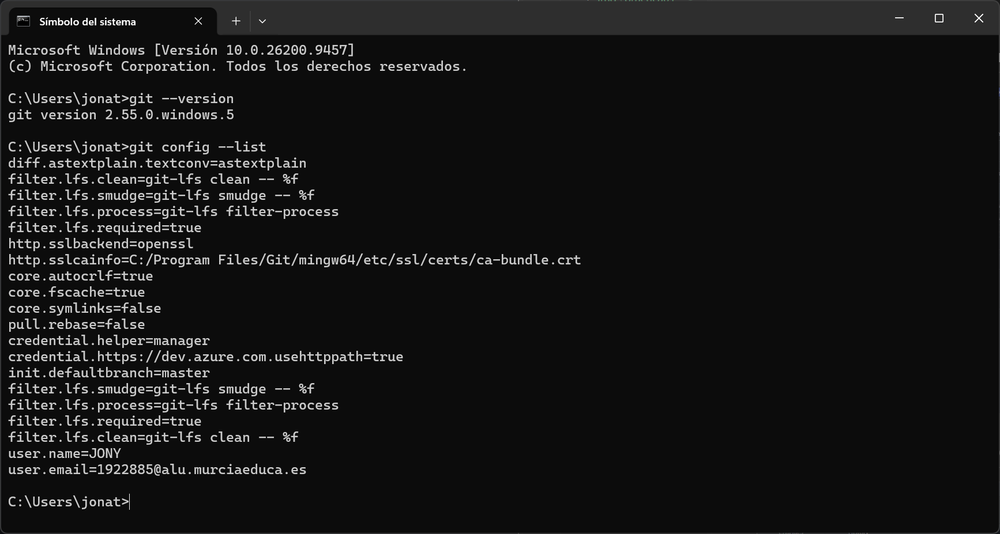
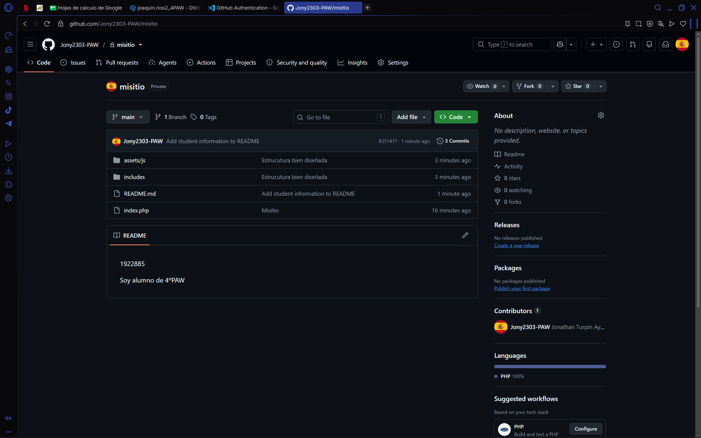
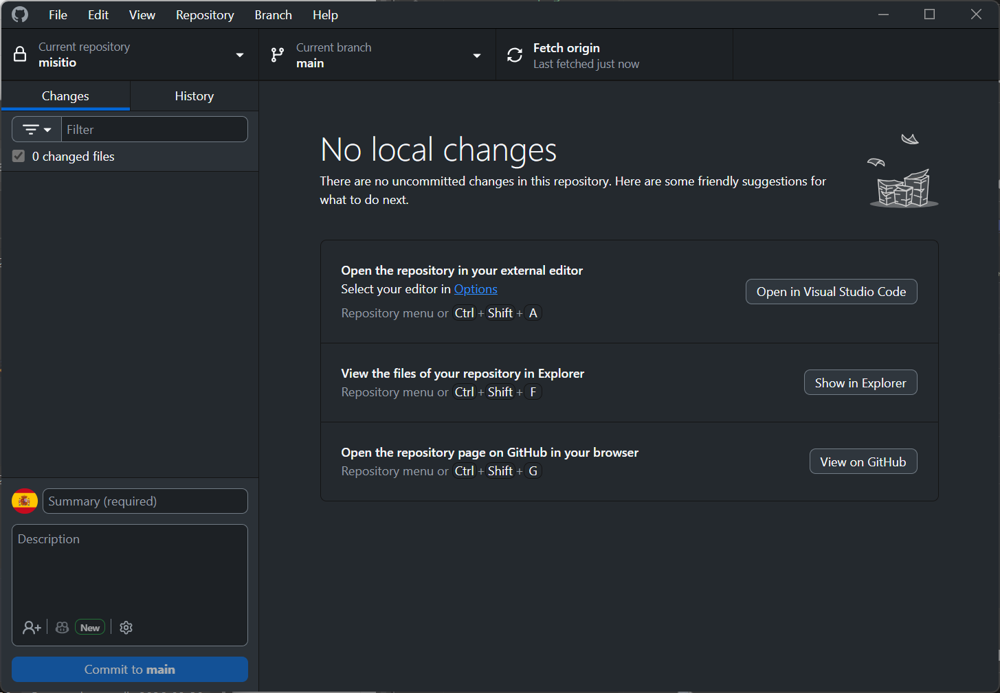
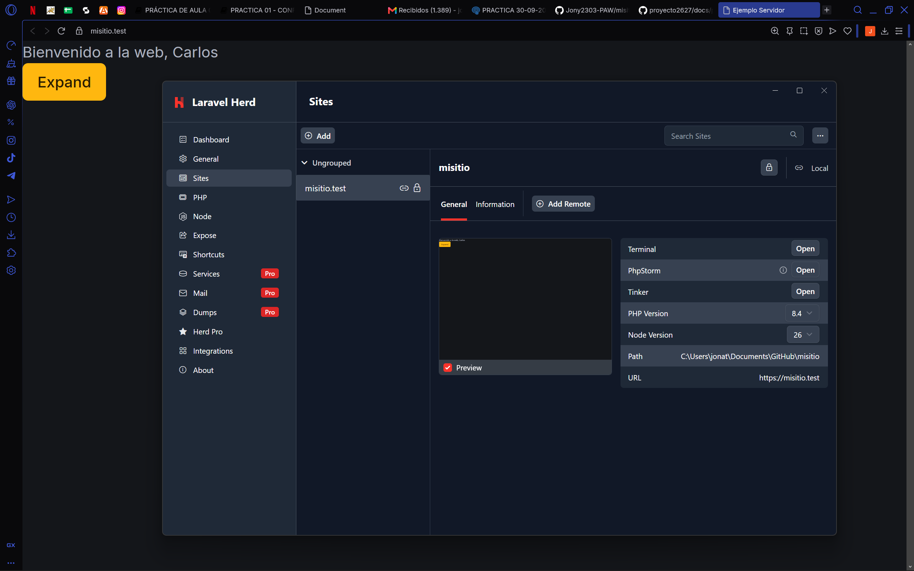

# Documento sobre la instalacion de ProperDocs

## - Git instalado y configurado en local

## - GitHub CLI instalado y configurado (gh auth status)

## - Herd instalado con la versión de PHP 8.4

## - Repositorio "misitio" clonado en local

## - Herd enlazado al repositorio "misitio" y sirviéndolo en HTTPS

## Resumen de los elementos y plugins

El resumen es que en esta pagina he utilizado elementos y plugins para agilizar la busqueda y tiene elementos como el tema

### Elementos

### Plugins

