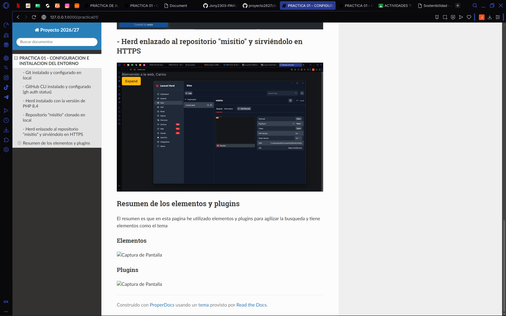

# Documento sobre la instalacion de ProperDocs:

## - Git instalado y configurado en local

## - GitHub CLI instalado y configurado (gh auth status).

## - Herd instalado con la versión de PHP 8.4.

## - Repositorio "misitio" clonado en local

## - Herd enlazado al repositorio "misitio" y sirviéndolo en HTTPS.

## Resumen de los elementos y plugins

### Elementos

### Plugins 

